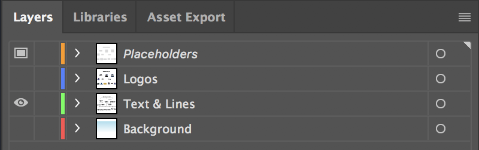
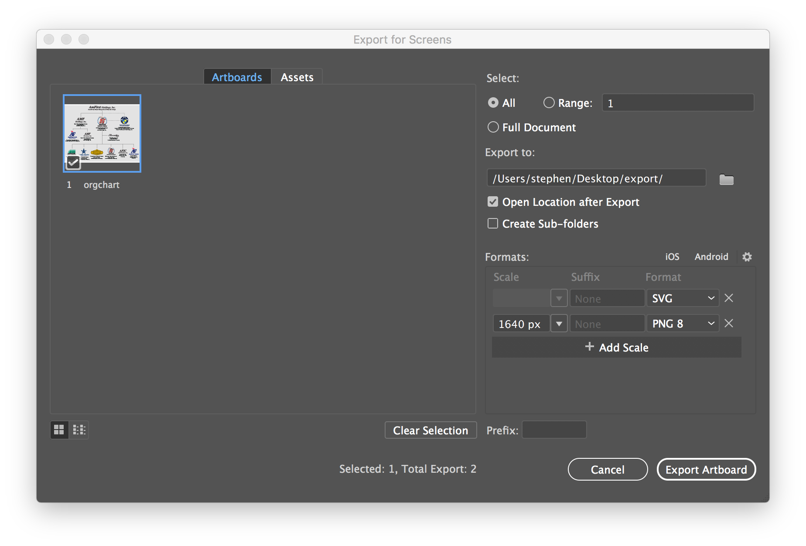
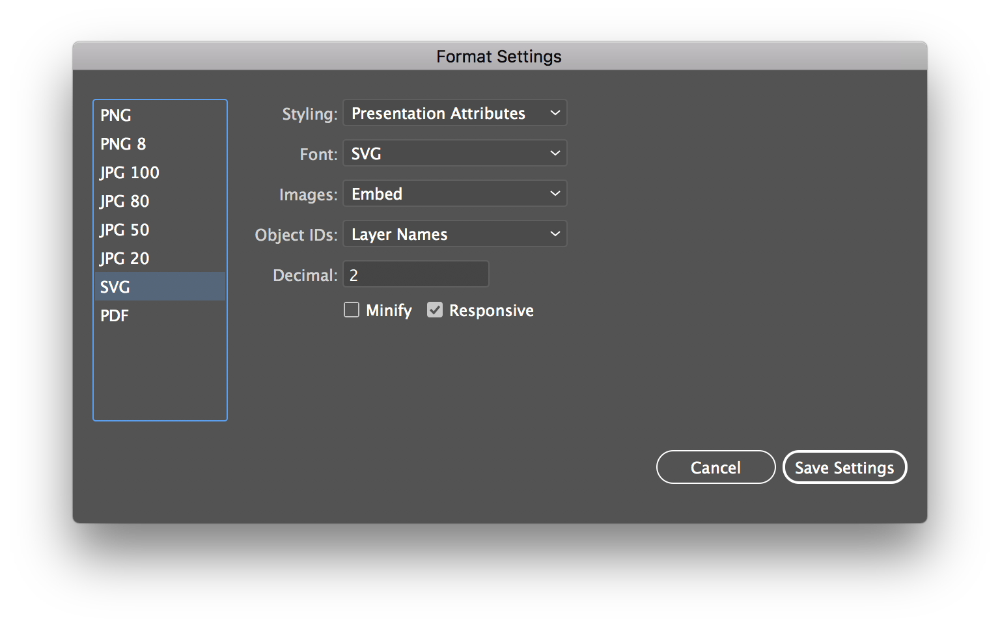

# Crema Logo and Fonts CDN
The following cdn can be used for all websites managed by Crema. I don't want to use them on externally controlled sites until it's rock-stable.

## Naming Scheme

**Carriers** 
http://cdn.cremadesignstudio.com/logos/carriers/ `CARRIER` - `SIZE` . `EXT`

**Corporate** 
http://cdn.cremadesignstudio.com/logos/corporate/ `COLOR` - `SIZE` . `EXT`

**Divisions** 
http://cdn.cremadesignstudio.com/logos/divisions/ `DIVISION` / `COLOR` - `SIZE` . `EXT`

**Partners** 
http://cdn.cremadesignstudio.com/logos/partners/ `PARTNER` / `STYLE` - `COLOR` - `SIZE` . `EXT`

**Products** 
http://cdn.cremadesignstudio.com/logos/products/ `PRODUCT` / `STYLE` - `COLOR` - `SIZE` . `EXT`

##### Notes
- The style tag is optional for the default logo
- The width tag is optional for 500px wide logos, since that is the largest size for raster logos.  However, I'm defaulting to svg and svgz files as much as possible.

#### Common Styles
- **Reversed** — color logo for dark backgrounds
- **White** — pure white logo for dark backgrounds
- **Black** — black or black and white logo
- **Color/4c** — haven't decided if the 4c abbreviation should be standard
- **Stacked/Square/Center** — besides the MWG division logos, this is the default
- **Horizontal** — duhh...used for wide logos.

## SVG Export Settings

## SVGZ Save as Copy Settings

## Export Org Charts
1. Open the latest Website Organization Chart.

2. Show the "Placeholders" layer and hide the "Logos" and "Background" layers.

3. Click File > Export > Export for Screens
4. Choose the following export settings:

5. Click the "Export Artboard" button. This will save a SVG source file and minified PNG file on your desktop.

6. Run the `make-orgchart` script in the "mwg" folder in this repo via the command line. This script will automatically build linked svg/svgz files using a predefined list of cdn urls.

> Note: Maybe I should just tell them to export an SVG using `File > Export As`? In that scenario, we'd need to write a script to convert the linked svg image to a PNG. Otherwise, the user would need to export twice.
