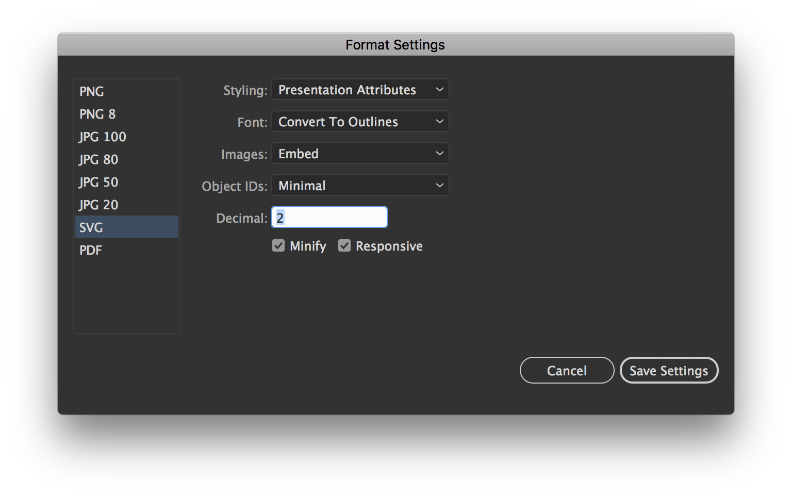
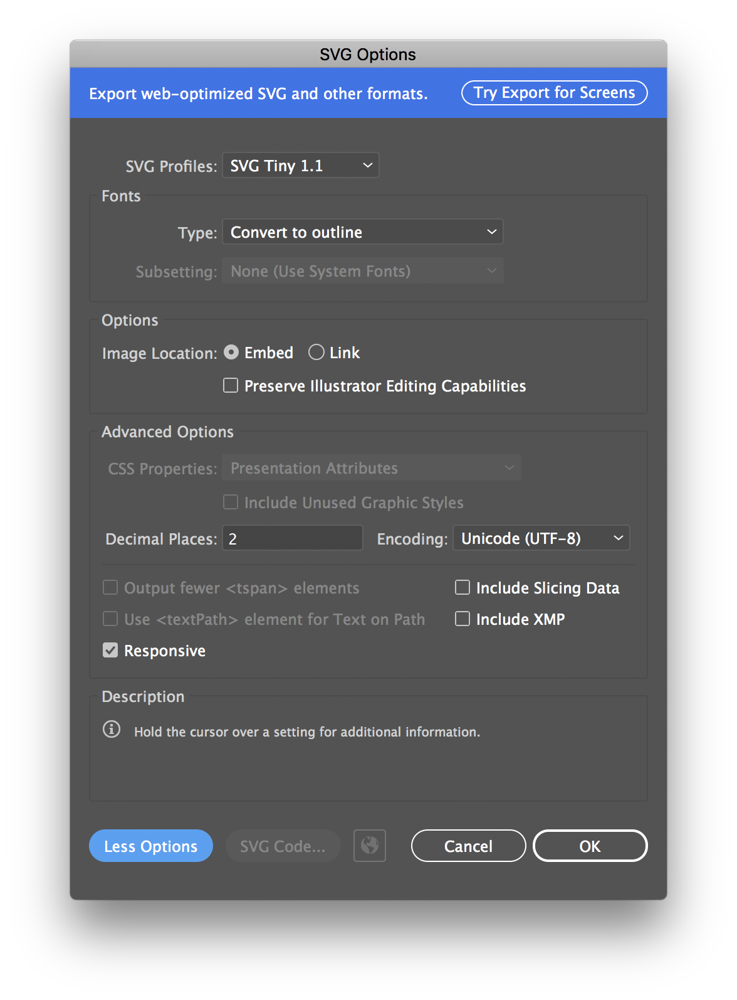
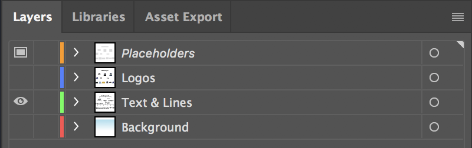
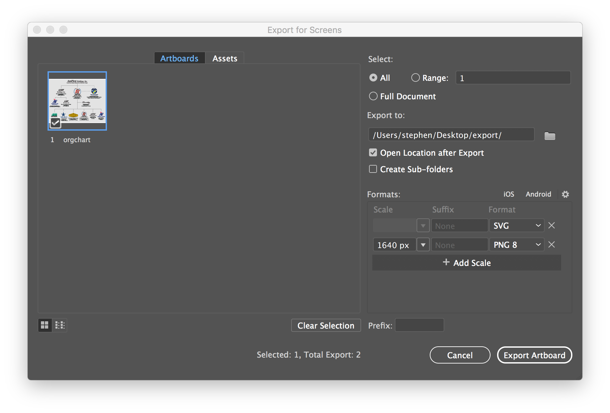
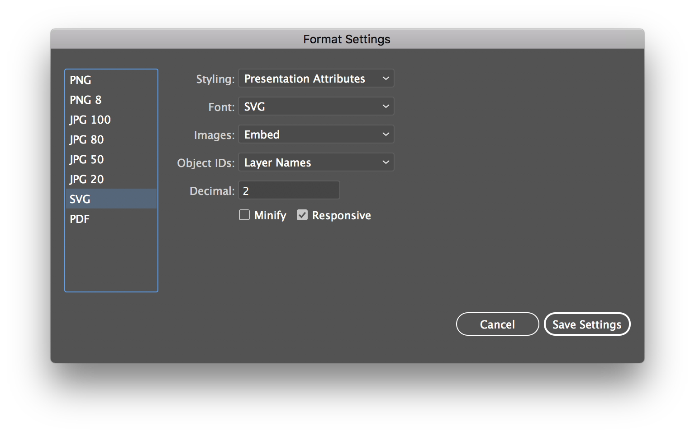

<h1 class="display-2">Crema CDN</h1>

> #### IMPORTANT NOTICE
> This cdn is intended only for websites directly managed by Crema. Do not use these URLs on any externally controlled or third-party sites. Usage outside Crema-managed properties is unsupported, as the naming schema and file structure **can change without notice.**

## Fonts
This repo hosts several versions of Font Awesome 4 and 5, which we link to on a ton of our sites.

## Logos
<details>
<summary class="h3">Naming Scheme</summary>
Logos are served from the CDN using a predictable, human-readable naming convention. The patterns below describe the available logo categories and supported modifiers.

**Carriers**
```
https://cdn.cremadesignstudio.com/logos/carriers/{carrier}-{width|height}.{format}
```

**Corporate**
```
https://cdn.cremadesignstudio.com/logos/corporate/{color}-{width|height}.{format}
```

**Divisions**
```
https://cdn.cremadesignstudio.com/logos/divisions/{division}/{color}-{width|height}.{format}
```

**Partners**
```
https://cdn.cremadesignstudio.com/logos/partners/{partner}/{style}-{color}-{width|height}.{format}
```

**Products**
```
https://cdn.cremadesignstudio.com/logos/products/{product}/{style}-{color}-{width|height}.{format}
```

#### Common Styles
- **Reversed** — Color logo optimized for dark backgrounds
- **White** — Pure white logo for dark backgrounds
- **Black** — Black or grayscale logo
- **Color / 4c** — Full-color logo (final abbreviation TBD)
- **Stacked / Square / Center** — Default orientation (except MWG division logos)
- **Horizontal** — Wide-format logo for horizontal layouts

### Logo File Variations
Beyond file format, logos may include descriptive keywords in the filename to indicate color, layout, or usage. These keywords define how and where each logo should be used.

#### Color Variations
Each color variation is considered a **distinct logo**.
| Description                     | Filename Pattern                        | Intended Background |
|---------------------------------|-----------------------------------------|---------------------|
| Full Color Logo                 | `color`                                 | White               |
| Black Logo                      | `black`                                 | White               |
| White Logo                      | `white`                                 | Brand Navy          |
| Reversed (Light) Logo           | `reverse`                               | Brand Navy          |
| Website-Optimized Logo          | `website`                               | Brand Navy          |

#### Style Variations
Each style variation is considered a **distinct logo**.
| Description                     | Filename Pattern                        | Intended Background |
|---------------------------------|-----------------------------------------|---------------------|
| Stacked Logo                    | `stacked`                               | N/A                 |
| Square Logo                     | `square`                                | N/A                 |
| Center Logo                     | `center`                                | N/A                 |
| Horizontal Logo                 | `horiz`, `horizontal`                   | N/A                 |


| Seasonal Logo                   | `halloween`, `christmas`                | White               |

#### Secondary Color Modifiers
These represent **variations of an existing logo**, not new logos.
| Description                     | Filename Pattern                        | Intended Background |
|---------------------------------|-----------------------------------------|---------------------|
| One-Color                       | `-1c`                                   | White               |
| One-Color (Solid)               | `-solid-1c`                             | White               |

#### Size Modifiers
Size modifiers indicate rendered dimensions and are considered **logo variations**.
| Description                     | Filename Pattern                        | Intended Background |
|---------------------------------|-----------------------------------------|---------------------|
| Width in Pixels                 | `-w250`, `-w500`, `-w{n}`               | N/A                 |
| Height in Pixels                | `-h85`, `-h{n}`                         | N/A                 |

#### Notes
- SVG and SVGZ are the preferred and primary logo formats.
- The style modifier is optional for default logos.
- The width modifier is optional for logos larger than 500px wide.
- Width values use the w prefix (e.g., w500 = 500px wide).
- Height values use the h prefix (e.g., h85 = 85px tall).
</details>

<details>
<summary class="h3">How to Export</summary>

## SVG Export Settings


## SVGZ Save as Copy Settings

</details>

## Linked Org Charts
<details>
<summary class="h3">Setup Export Scripts</summary>

To avoid file duplication and optimize caching, we're using linked svg/svgz files. Unfortunately, this is a manual process, since Illustrator does not support it. However, our org chart scripts should make this process easier.

Clone this repo and run the following commands to install these scripts:
```
npm install -g svgo@2.3.0
yarn install
```
</details>

<details>
<summary class="h3">How to Export</summary>
	
1. Open the latest Website Organization Chart.

2. <details><summary>Show the "Placeholders" layer and hide the "Logos" and "Background" layers...</summary></details>

3. Click File > Export > Export for Screens

4. <details><summary>Choose the following export settings...</summary></details>

5. Click the "Export Artboard" button. This will save a SVG source file and minified PNG file on your desktop. Move this file into this repo's "www/mwg" directory.

6. Run `yarn build` in this repo's root directory via the command line. This script will automatically build a linked svg file using a predefined list of cdn urls.

> Note: The "orgchart.svg" file I created in May 2024 has been manually optimized. In that process, I discovered Safari doesn't support using "calc" on the svg "x" attribute, but DOES support it within inline style tags.
</details>
