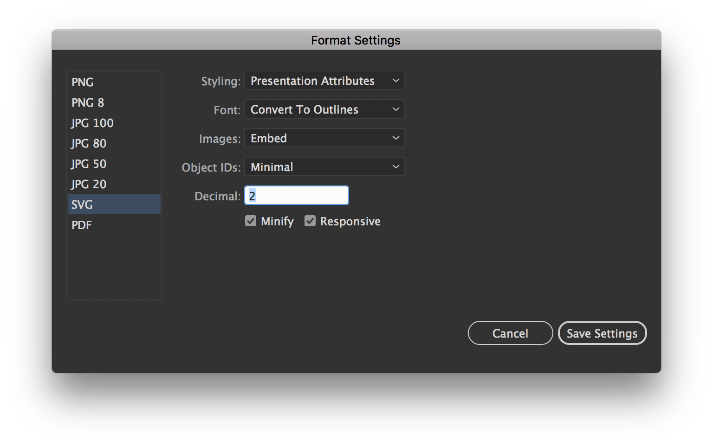
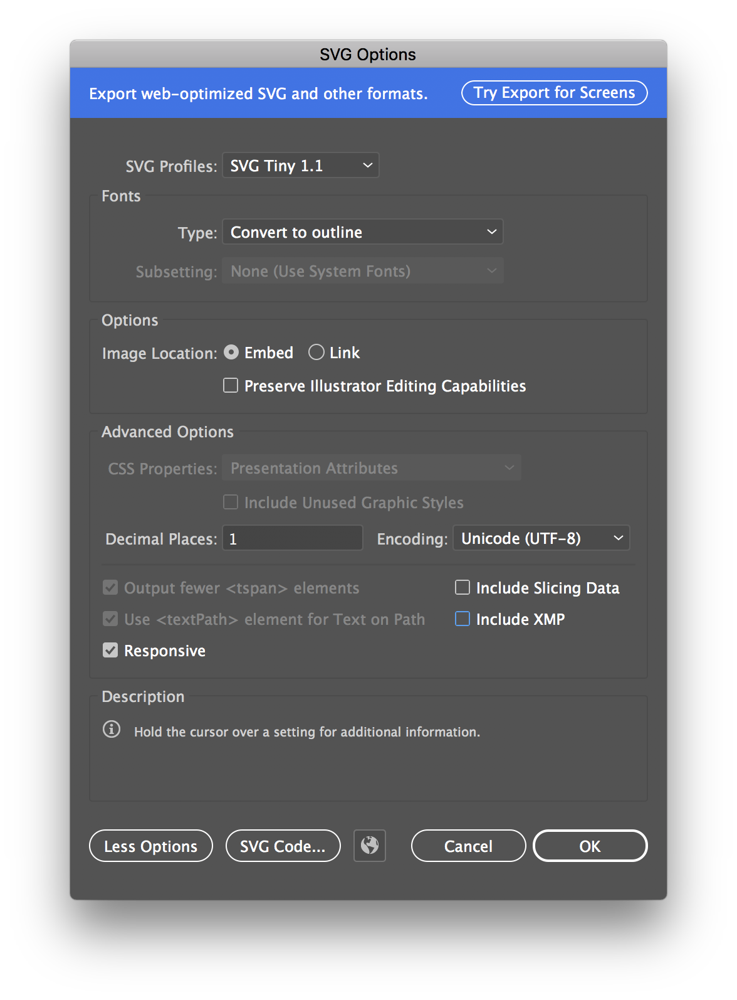

# Crema Logo and Fonts CDN
The following cdn can be used for all websites managed by Crema. I don't want to use them on externally controlled sites until it's rock-stable.

## Naming Scheme

**Corporate** 
http://cdn.cremadesignstudio.com/logos/corporate/ `COLOR` - `SIZE` . `EXT`

**Divisions** 
http://cdn.cremadesignstudio.com/logos/divisions/ `DIVISION` / `STYLE` - `COLOR` - `SIZE` . `EXT`

**Partners** 
http://cdn.cremadesignstudio.com/logos/partners/ `PARTNER` / `STYLE` - `COLOR` - `SIZE` . `EXT`

**Products** 
http://cdn.cremadesignstudio.com/logos/products/ `PRODUCT` / `STYLE` - `COLOR` - `SIZE` . `EXT`

**Carriers** 
http://cdn.cremadesignstudio.com/logos/carriers/ `CARRIER` - `SIZE` . `EXT`

##### Notes
- The style tag is optional for the default logo
- The width tag is optional for 500px wide logos, since that is the largest size for raster logos.  However, I'm defaulting to svg and svgz files as much as possible.

#### Common Styles
- **Reversed** — color logo for dark backgrounds
- **White** — pure white logo for dark backgrounds
- **Black** — black or black and white logo
- **Color/4c** — haven't decided if the 4c abbreviation should be standard
- **Stacked/Square** — besides the MWG division logos, this is the default
- **Horizontal** — duhh...used for wide logos.

## SVG Export Settings

## SVGZ Save as Copy Settings

